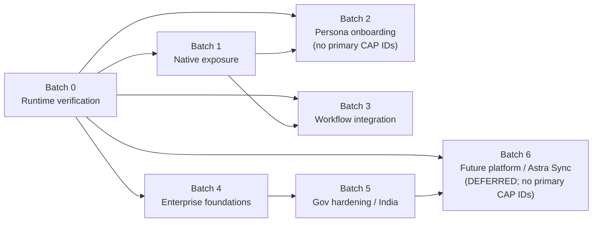

# Astra Rollout Plan (Phase 3)

> Source identity: `HUMAN_APPROVED_ASTRA_62_CATALOG_2026-07-19`
> Baseline: `architecture/astra-capability-rfcs` @ `29d95dd9ee311331f328e4c57162bddc7a900d36`
>
> Planning document only. Batch assignment is **not** source completion, packaging proof,
> runtime proof, or a marketing claim. `native_evidence` and `astra_integration_evidence`
> remain **E0** while the pinned Firefox `engine/` tree and verified installer SourceStamp
> evidence are absent. Registry `readiness_status` is **not** advanced in Phase 3.
>
> Primary batch assignments reuse the registry `batch` field (Batches 0, 1, 3, 4, 5).
> Audit Batches 2 and 6 are retained as program tracks with **no primary capability IDs**
> (persona composition and future platform Sync respectively).

## Batch summary

| Batch | Name | Primary capability count | Typical release posture |
|---|---|---:|---|
| Batch 0 | Runtime verification | 21 | REQUIRED / OPTIONAL / DEFERRED per capability (verify-only) |
| Batch 1 | Low-risk native exposure | 19 | OPTIONAL_FOR_CURRENT_BETA |
| Batch 2 | Persona onboarding | 0 (composite track) | OPTIONAL_FOR_CURRENT_BETA program track |
| Batch 3 | Workflow integration | 10 | OPTIONAL / DEFERRED_POST_BETA |
| Batch 4 | Enterprise foundations | 10 | DEFERRED_POST_BETA / BLOCKED |
| Batch 5 | Government hardening & India packaging | 2 | BLOCKED / DEFERRED_POST_BETA |
| Batch 6 | Future platform systems | 0 (platform track) | DEFERRED_POST_BETA (Astra Sync blocked) |

## Candidate minimum beta validation set

The 15 capabilities marked `REQUIRED_FOR_CURRENT_BETA` are the **candidate minimum beta validation set** — the smallest honest Batch 0 verification target for the current beta launch. They are **not** proven beta-ready features. Batch assignment alone does not prove runtime behavior, packaging, or public claims.

1. **Batch 0 runtime verification (still NOT TESTED)** of already-packaged foundations in that candidate set (PDF view/forms, downloads, Places, session restore, PiP, WebRTC, media decode without DRM claims, autoplay, containers, ETP/TCP/SB/permissions, signed add-ons).
2. **Do not require** Batch 1–6 code for MVP launch claims.
3. **Explicitly out of MVP claims:** Widevine hard claims (CAP-043), Astra-branded Sync (CAP-054 / Batch 6), enterprise-ready (Batch 4), government-ready (Batch 5), signed auto-update (CAP-039/060), offline silent deployment (CAP-042), ADMX shipping (CAP-034).

Batch assignment ≠ runtime PASS. Source validators are not runtime proof. All runtime results remain **NOT TESTED** until recorded against a correct SourceStamp.

## Dependency graph

No circular batch dependencies. Persona (Batch 2) depends on verified natives/entrypoints (0→1). Enterprise (4) does not depend on persona. Government (5) depends on enterprise. Future Sync (6) is deferred and must not rebrand FxA.

## Per-batch detail

### Batch 0 — Runtime verification (no code changes)

| Field | Value |
|---|---|
| Purpose | Convert packaged natives and existing Astra/Zen surfaces from audit PACKAGED → RUNTIME TESTED on a correct installer. Observation only; no implementation diffs. |
| Entry criteria | Completed installer build with correct BuildID + SourceStamp; architecture registry and feature docs present. |
| Depends on batches | _none_ |
| Blocking conflicts | `ASTRA-CONFLICT-019`, `ASTRA-CONFLICT-010`, `ASTRA-CONFLICT-011`, `ASTRA-CONFLICT-012`, `ASTRA-CONFLICT-013`, `ASTRA-CONFLICT-030`, `ASTRA-CONFLICT-031` |
| Required evidence before implementation | N/A — Batch 0 implements nothing. Requires pinned installer SourceStamp before any PASS result is recorded. |
| Required evidence before runtime rollout | Correct installer BuildID/SourceStamp; native_evidence and astra_integration_evidence remain E0 until tests are recorded; planning is not runtime proof. |
| Rollback boundary | N/A (verification-only). |
| Release note | Batch 0 hosts the candidate minimum beta validation set for already-shipped foundations. It does not authorize marketing claims or imply runtime PASS. |

**Primary capability IDs (21):** `ASTRA-CAP-001`, `ASTRA-CAP-003`, `ASTRA-CAP-011`, `ASTRA-CAP-012`, `ASTRA-CAP-014`, `ASTRA-CAP-015`, `ASTRA-CAP-016`, `ASTRA-CAP-017`, `ASTRA-CAP-043`, `ASTRA-CAP-044`, `ASTRA-CAP-047`, `ASTRA-CAP-048`, `ASTRA-CAP-049`, `ASTRA-CAP-050`, `ASTRA-CAP-054`, `ASTRA-CAP-055`, `ASTRA-CAP-056`, `ASTRA-CAP-057`, `ASTRA-CAP-058`, `ASTRA-CAP-059`, `ASTRA-CAP-061`

| Capability | Title | Release status | Reason |
|---|---|---|---|
| `ASTRA-CAP-001` | PDF viewing and navigation | `REQUIRED_FOR_CURRENT_BETA` | Core student PDF view path; verify only on correct installer. |
| `ASTRA-CAP-003` | PDF forms support | `REQUIRED_FOR_CURRENT_BETA` | Core PDF forms path; verify only. |
| `ASTRA-CAP-011` | Downloads management and search | `REQUIRED_FOR_CURRENT_BETA` | Downloads are everyday baseline; verify SMART Guard + SB. |
| `ASTRA-CAP-012` | Bookmarks, history and Places | `REQUIRED_FOR_CURRENT_BETA` | Places is foundational; verify only. |
| `ASTRA-CAP-014` | Session restore and recently closed tabs/windows | `REQUIRED_FOR_CURRENT_BETA` | Crash-restore is beta-critical; dual-store conflict must be exercised. |
| `ASTRA-CAP-015` | Picture-in-Picture | `REQUIRED_FOR_CURRENT_BETA` | Lecture/media PiP is high-value student path; verify media protection. |
| `ASTRA-CAP-016` | Camera, microphone and screen-sharing permissions | `REQUIRED_FOR_CURRENT_BETA` | Class/call permissions are beta-critical; verify ICE prefs. |
| `ASTRA-CAP-017` | Spellcheck and dictionaries | `OPTIONAL_FOR_CURRENT_BETA` | Spellcheck verify; Indian dictionaries packaging remains gated. |
| `ASTRA-CAP-043` | Widevine / EME protected playback | `DEFERRED_POST_BETA` | DRM playback may be smoke-tested in Batch 0, but hard DRM/marketing claims stay deferred (licensing + ETP/uBlock compat). |
| `ASTRA-CAP-044` | OpenH264 / Windows media decoding | `REQUIRED_FOR_CURRENT_BETA` | Baseline media decode path; verify without DRM certification claims. |
| `ASTRA-CAP-047` | Autoplay controls | `REQUIRED_FOR_CURRENT_BETA` | Autoplay defaults affect everyday media; verify. |
| `ASTRA-CAP-048` | Fullscreen, subtitles and captions | `OPTIONAL_FOR_CURRENT_BETA` | Fullscreen/captions verify; not MVP-claim critical. |
| `ASTRA-CAP-049` | Audio tab indicator and mute controls | `OPTIONAL_FOR_CURRENT_BETA` | NEEDS_CLARIFICATION matrix mapping; verify if time allows. |
| `ASTRA-CAP-050` | Container tabs / contextual identities | `REQUIRED_FOR_CURRENT_BETA` | Containers foundation for Work separation; verify. |
| `ASTRA-CAP-054` | Existing Firefox Account / Sync identity | `DEFERRED_POST_BETA` | Keep native FxA/Sync; any Astra-branded Sync claim remains deferred/blocked (EXCLUSION-008 / CONFLICT-028). Batch 0 may verify existing Sync UI strings only. |
| `ASTRA-CAP-055` | Enhanced Tracking Protection | `REQUIRED_FOR_CURRENT_BETA` | ETP strict is core privacy posture; verify. |
| `ASTRA-CAP-056` | Total Cookie Protection | `REQUIRED_FOR_CURRENT_BETA` | TCP is core privacy posture; verify. |
| `ASTRA-CAP-057` | Safe Browsing and download protection | `REQUIRED_FOR_CURRENT_BETA` | Safe Browsing + download protection; verify. |
| `ASTRA-CAP-058` | Site permissions and clear-site-data controls | `REQUIRED_FOR_CURRENT_BETA` | Permissions/clear-site-data; verify PBM. |
| `ASTRA-CAP-059` | HTTPS and DNS modes | `OPTIONAL_FOR_CURRENT_BETA` | HTTPS/DoH UX polish optional; native modes already defaulted. |
| `ASTRA-CAP-061` | Firefox add-ons ecosystem and extension debugging | `REQUIRED_FOR_CURRENT_BETA` | Signed add-ons ecosystem; verify uBlock/ETP compat checklist start. |

### Batch 1 — Low-risk native exposure

| Field | Value |
|---|---|
| Purpose | Surface mature natives via discoverability entrypoints and polish existing Astra commands; no new backends. |
| Entry criteria | Batch 0 green for the native surfaces being exposed. |
| Depends on batches | `Batch 0` |
| Blocking conflicts | `ASTRA-CONFLICT-025`, `ASTRA-CONFLICT-029`, `ASTRA-CONFLICT-020`, `ASTRA-CONFLICT-026` |
| Required evidence before implementation | Design docs + registry state/conflict resolution; shortcut-conflict validator plan; lazy entrypoint pattern. |
| Required evidence before runtime rollout | Batch 0 native path PASS; each new entrypoint opens correct native surface; PBM/a11y smoke NOT TESTED until recorded. |
| Rollback boundary | Remove menu/command/entrypoint or flip proposed astra.* flags (when created later). |
| Release note | Optional for current beta after Batch 0; not required for MVP launch claims. |

**Primary capability IDs (19):** `ASTRA-CAP-002`, `ASTRA-CAP-004`, `ASTRA-CAP-005`, `ASTRA-CAP-006`, `ASTRA-CAP-007`, `ASTRA-CAP-008`, `ASTRA-CAP-009`, `ASTRA-CAP-010`, `ASTRA-CAP-013`, `ASTRA-CAP-018`, `ASTRA-CAP-019`, `ASTRA-CAP-020`, `ASTRA-CAP-021`, `ASTRA-CAP-022`, `ASTRA-CAP-023`, `ASTRA-CAP-024`, `ASTRA-CAP-027`, `ASTRA-CAP-028`, `ASTRA-CAP-029`

| Capability | Title | Release status | Reason |
|---|---|---|---|
| `ASTRA-CAP-002` | PDF annotations and editing tools | `OPTIONAL_FOR_CURRENT_BETA` | Thin annotation entrypoint after PDF verify. |
| `ASTRA-CAP-004` | PDF signatures | `OPTIONAL_FOR_CURRENT_BETA` | Signature entrypoint after PDF verify. |
| `ASTRA-CAP-005` | Print / Save as PDF workflows | `OPTIONAL_FOR_CURRENT_BETA` | Print/Save-as-PDF entrypoint after PDF verify. |
| `ASTRA-CAP-006` | Reader Mode | `OPTIONAL_FOR_CURRENT_BETA` | Reader discoverability after Batch 0. |
| `ASTRA-CAP-007` | Narrate / Read Aloud | `OPTIONAL_FOR_CURRENT_BETA` | Read-Aloud polish; existing command. |
| `ASTRA-CAP-008` | On-device webpage translation | `OPTIONAL_FOR_CURRENT_BETA` | Translation entrypoint after model download path verified. |
| `ASTRA-CAP-009` | Translation model download and offline status | `OPTIONAL_FOR_CURRENT_BETA` | ENABLE_AFTER_TEST; offline model status after Batch 0 translation verify. |
| `ASTRA-CAP-010` | Page and full-page screenshots | `OPTIONAL_FOR_CURRENT_BETA` | Screenshots entrypoint after Batch 0. |
| `ASTRA-CAP-013` | Open-tab search / urlbar TABS mode | `OPTIONAL_FOR_CURRENT_BETA` | Tab-search polish; existing command. |
| `ASTRA-CAP-018` | Zoom, contrast, reduced motion and keyboard navigation | `OPTIONAL_FOR_CURRENT_BETA` | A11y entrypoint; full AT audit still deferred. |
| `ASTRA-CAP-019` | Page Inspector | `OPTIONAL_FOR_CURRENT_BETA` | Developer Hub launcher slice. |
| `ASTRA-CAP-020` | Web Console | `OPTIONAL_FOR_CURRENT_BETA` | Developer Hub launcher slice. |
| `ASTRA-CAP-021` | JavaScript Debugger | `OPTIONAL_FOR_CURRENT_BETA` | Developer Hub launcher slice. |
| `ASTRA-CAP-022` | Network Monitor | `OPTIONAL_FOR_CURRENT_BETA` | Developer Hub launcher slice. |
| `ASTRA-CAP-023` | Storage Inspector | `OPTIONAL_FOR_CURRENT_BETA` | Developer Hub launcher slice. |
| `ASTRA-CAP-024` | Responsive Design Mode | `OPTIONAL_FOR_CURRENT_BETA` | Developer Hub launcher slice. |
| `ASTRA-CAP-027` | Service Worker inspection | `OPTIONAL_FOR_CURRENT_BETA` | NATIVE_ONLY DevTools panel verify/exposure. |
| `ASTRA-CAP-028` | WebSocket inspection | `OPTIONAL_FOR_CURRENT_BETA` | NATIVE_ONLY DevTools panel verify/exposure. |
| `ASTRA-CAP-029` | Source maps and CSS grid/flex tools | `OPTIONAL_FOR_CURRENT_BETA` | NATIVE_ONLY DevTools tooling verify/exposure. |

### Batch 2 — Persona onboarding

| Field | Value |
|---|---|
| Purpose | Persona presets (Simple/Student/Developer/Work/Entertainment/Custom) over Spaces/App Hub visibility. No primary ASTRA-CAP IDs — presets compose capabilities assigned to Batches 0/1/3. |
| Entry criteria | Batch 0 Spaces/App Hub/Welcome verified; Batch 1 entrypoints available; policy-precedence guardrails designed. |
| Depends on batches | `Batch 0`, `Batch 1` |
| Blocking conflicts | `ASTRA-CONFLICT-024`, `ASTRA-CONFLICT-003`, `ASTRA-CONFLICT-023` |
| Required evidence before implementation | Persona design + policy-always-wins rule; no locked-pref writes. |
| Required evidence before runtime rollout | Preset apply/revert tests; managed-policy wins; no data duplication. |
| Rollback boundary | Clear astra.persona.selected → Simple (when created). |
| Release note | OPTIONAL_FOR_CURRENT_BETA as a program track; no primary capability IDs (composites only). Must not imply enterprise/managed status. |

**Primary capability IDs:** _none_ (program track only).

### Batch 3 — Workflow integration

| Field | Value |
|---|---|
| Purpose | Deepen Developer Hub tiers, Media Readiness, profiles/migration polish, advanced debugging over verified natives. |
| Entry criteria | Batches 0–1 green for touched natives; media protected-tab predicate designed (CONFLICT-030). |
| Depends on batches | `Batch 0`, `Batch 1` |
| Blocking conflicts | `ASTRA-CONFLICT-003`, `ASTRA-CONFLICT-005`, `ASTRA-CONFLICT-006`, `ASTRA-CONFLICT-030`, `ASTRA-CONFLICT-010` |
| Required evidence before implementation | State ownership + lazy panel pattern; no second profile/migration/DRM backends. |
| Required evidence before runtime rollout | Workflow E2E NOT TESTED until recorded; DRM status must remain truthful-only. |
| Rollback boundary | Per-flag disable / remove panels. |
| Release note | Mostly DEFERRED_POST_BETA; Migration Center polish may be OPTIONAL after Batch 0 import verify. |

**Primary capability IDs (10):** `ASTRA-CAP-025`, `ASTRA-CAP-026`, `ASTRA-CAP-030`, `ASTRA-CAP-031`, `ASTRA-CAP-032`, `ASTRA-CAP-045`, `ASTRA-CAP-046`, `ASTRA-CAP-051`, `ASTRA-CAP-052`, `ASTRA-CAP-053`

| Capability | Title | Release status | Reason |
|---|---|---|---|
| `ASTRA-CAP-025` | Accessibility Inspector | `DEFERRED_POST_BETA` | Developer Hub a11y shell after Batch 1 launchers. |
| `ASTRA-CAP-026` | Performance Profiler | `DEFERRED_POST_BETA` | Profiler shell after Batch 1. |
| `ASTRA-CAP-030` | Browser Console | `DEFERRED_POST_BETA` | ENABLE_AFTER_TEST chrome console. |
| `ASTRA-CAP-031` | Browser Toolbox / chrome debugging | `DEFERRED_POST_BETA` | ENABLE_AFTER_TEST Browser Toolbox. |
| `ASTRA-CAP-032` | Remote and add-on debugging | `DEFERRED_POST_BETA` | ENABLE_AFTER_TEST remote/add-on debugging. |
| `ASTRA-CAP-045` | Hardware acceleration and video decode status | `DEFERRED_POST_BETA` | Media Readiness HW status; no HW-accel marketing claim. |
| `ASTRA-CAP-046` | Media Session / global media controls | `DEFERRED_POST_BETA` | Media controls off by default until tested. |
| `ASTRA-CAP-051` | Native local profiles and switcher | `DEFERRED_POST_BETA` | Profiles switcher UX after dual-profile risk accounted. |
| `ASTRA-CAP-052` | Native browser migration wizard | `OPTIONAL_FOR_CURRENT_BETA` | Migration Center already packaged; polish after Batch 0 import verify. |
| `ASTRA-CAP-053` | Bookmarks, passwords and history import resources | `OPTIONAL_FOR_CURRENT_BETA` | Import resources verify with Migration Center. |

### Batch 4 — Enterprise foundations

| Field | Value |
|---|---|
| Purpose | Make packaged EnterprisePolicies usable: sample policies, ADMX, managed status, cert/proxy/DoH/update exposure. |
| Entry criteria | Batch 0 policy load verified; no persona batch claiming managed status. |
| Depends on batches | `Batch 0` |
| Blocking conflicts | `ASTRA-CONFLICT-024`, `ASTRA-CONFLICT-027` |
| Required evidence before implementation | policies-schema validation plan; ADMX packaging decision for CAP-034. |
| Required evidence before runtime rollout | Deploy policy file/GPO; about:policies; managed indicator. Secure-update claims remain blocked. |
| Rollback boundary | Remove distribution/ADMX/docs/status panel. |
| Release note | DEFERRED_POST_BETA / BLOCKED items; outside the candidate minimum beta validation set. |

**Primary capability IDs (10):** `ASTRA-CAP-033`, `ASTRA-CAP-034`, `ASTRA-CAP-035`, `ASTRA-CAP-036`, `ASTRA-CAP-037`, `ASTRA-CAP-038`, `ASTRA-CAP-039`, `ASTRA-CAP-040`, `ASTRA-CAP-041`, `ASTRA-CAP-060`

| Capability | Title | Release status | Reason |
|---|---|---|---|
| `ASTRA-CAP-033` | EnterprisePolicies engine | `DEFERRED_POST_BETA` | Policy engine packaged; enterprise-ready claim deferred until deployment proof. |
| `ASTRA-CAP-034` | Windows GPO / ADMX deployment support | `BLOCKED` | ADMX templates absent (NEEDS_CLARIFICATION); blocked until templates ship. |
| `ASTRA-CAP-035` | Managed bookmarks | `DEFERRED_POST_BETA` | Managed bookmarks after policy foundations. |
| `ASTRA-CAP-036` | Extension allowlist/blocklist and install policies | `DEFERRED_POST_BETA` | Extension policies after enterprise foundations. |
| `ASTRA-CAP-037` | Proxy and DoH policy controls | `DEFERRED_POST_BETA` | Proxy/DoH policy UX after enterprise foundations. |
| `ASTRA-CAP-038` | Enterprise roots and internal certificate authorities | `DEFERRED_POST_BETA` | Enterprise roots visibility after enterprise foundations. |
| `ASTRA-CAP-039` | Update policy and channel control | `BLOCKED` | Update policy/channel tied to unsigned-update integrity gap (CONFLICT-027 / EXCLUSION-007). |
| `ASTRA-CAP-040` | Telemetry and crash-report policy controls | `BLOCKED` | Crash reporter not shipped; telemetry controls need clarification. |
| `ASTRA-CAP-041` | Managed-browser / about:policies status | `DEFERRED_POST_BETA` | Managed status panel after policy load verified. |
| `ASTRA-CAP-060` | Native updater, troubleshooting and recovery foundations | `BLOCKED` | Updater/recovery foundations blocked for secure-update claims until signed MAR proven. |

### Batch 5 — Government hardening & India packaging

| Field | Value |
|---|---|
| Purpose | Signed updates, offline/admin workflows, India langpack/dictionary packaging, a11y/compliance prerequisites. |
| Entry criteria | Batch 4 foundations; external security audit kickoff. |
| Depends on batches | `Batch 4` |
| Blocking conflicts | `ASTRA-CONFLICT-027`, `ASTRA-CONFLICT-026`, `ASTRA-CONFLICT-020`, `ASTRA-CONFLICT-031` |
| Required evidence before implementation | Update-signing infra design; offline installer plan; dictionary packaging inventory. |
| Required evidence before runtime rollout | Signed MAR + rollback + tamper; AT + hi-IN packaging proof. Government claims stay blocked until complete. |
| Rollback boundary | Revert to prior signed build / disable offline packaging path. |
| Release note | BLOCKED / DEFERRED_POST_BETA. Government readiness blocked. |

**Primary capability IDs (2):** `ASTRA-CAP-042`, `ASTRA-CAP-062`

| Capability | Title | Release status | Reason |
|---|---|---|---|
| `ASTRA-CAP-042` | Offline/silent deployment foundation | `BLOCKED` | Offline/silent deployment requires installer packaging + security review. |
| `ASTRA-CAP-062` | Hindi/Indian-language UI, dictionaries and local translation workflows | `DEFERRED_POST_BETA` | India-language packaging verification after langpack/dictionary proof; not beta-claim ready. |

### Batch 6 — Future platform systems

| Field | Value |
|---|---|
| Purpose | Independent Astra account/Sync/mobile continuity — only if not rebranding Firefox Sync. No primary ASTRA-CAP IDs; CAP-054 remains Batch 0 USE_NATIVE with Sync claims deferred. |
| Entry criteria | Legal review + platform design; Batches 0–5 as needed. |
| Depends on batches | `Batch 0`, `Batch 5` |
| Blocking conflicts | `ASTRA-CONFLICT-028`, `ASTRA-CONFLICT-006` |
| Required evidence before implementation | Legal/architecture RFC; no FxA rebrand. |
| Required evidence before runtime rollout | Opt-in only; isolation from FxA; E6/E7 before any public claim. |
| Rollback boundary | Feature-flag off; no forced migration. |
| Release note | DEFERRED_POST_BETA. Astra-branded Sync remains blocked while Firefox OAuth identity is the native identity. |

**Primary capability IDs:** _none_ (program track only).

## Capability dependency table (all 62)

Every capability has exactly one `primary_batch` (from the registry). Cross-batch dependencies do not create a second primary assignment.

| Capability | primary_batch | depends_on_capability_ids | depends_on_batch_ids | blocks_capability_ids | release_gate | rollback_scope |
|---|---|---|---|---|---|---|
| `ASTRA-CAP-001` | `Batch 0` | — | — | ASTRA-CAP-002 ASTRA-CAP-003 ASTRA-CAP-004 ASTRA-CAP-005 | `REQUIRED_FOR_CURRENT_BETA` | native command/pref/policy |
| `ASTRA-CAP-002` | `Batch 1` | ASTRA-CAP-001 | Batch 0 | — | `OPTIONAL_FOR_CURRENT_BETA` | Astra surface flag/removal; native backend remains |
| `ASTRA-CAP-003` | `Batch 0` | ASTRA-CAP-001 | — | — | `REQUIRED_FOR_CURRENT_BETA` | native command/pref/policy |
| `ASTRA-CAP-004` | `Batch 1` | ASTRA-CAP-001 | Batch 0 | — | `OPTIONAL_FOR_CURRENT_BETA` | Astra surface flag/removal; native backend remains |
| `ASTRA-CAP-005` | `Batch 1` | ASTRA-CAP-001 | Batch 0 | — | `OPTIONAL_FOR_CURRENT_BETA` | Astra surface flag/removal; native backend remains |
| `ASTRA-CAP-006` | `Batch 1` | — | — | ASTRA-CAP-007 | `OPTIONAL_FOR_CURRENT_BETA` | Astra surface flag/removal; native backend remains |
| `ASTRA-CAP-007` | `Batch 1` | ASTRA-CAP-006 | Batch 0 | — | `OPTIONAL_FOR_CURRENT_BETA` | Astra surface flag/removal; native backend remains |
| `ASTRA-CAP-008` | `Batch 1` | — | Batch 0 | ASTRA-CAP-009 ASTRA-CAP-062 | `OPTIONAL_FOR_CURRENT_BETA` | Astra surface flag/removal; native backend remains |
| `ASTRA-CAP-009` | `Batch 1` | ASTRA-CAP-008 | Batch 0 | — | `OPTIONAL_FOR_CURRENT_BETA` | Astra surface flag/removal; native backend remains |
| `ASTRA-CAP-010` | `Batch 1` | — | — | — | `OPTIONAL_FOR_CURRENT_BETA` | Astra surface flag/removal; native backend remains |
| `ASTRA-CAP-011` | `Batch 0` | — | — | ASTRA-CAP-057 | `REQUIRED_FOR_CURRENT_BETA` | Astra surface flag/removal; native backend remains |
| `ASTRA-CAP-012` | `Batch 0` | — | — | ASTRA-CAP-035 | `REQUIRED_FOR_CURRENT_BETA` | native command/pref/policy |
| `ASTRA-CAP-013` | `Batch 1` | — | Batch 0 | — | `OPTIONAL_FOR_CURRENT_BETA` | Astra surface flag/removal; native backend remains |
| `ASTRA-CAP-014` | `Batch 0` | — | — | ASTRA-CAP-060 | `REQUIRED_FOR_CURRENT_BETA` | Astra surface flag/removal; native backend remains |
| `ASTRA-CAP-015` | `Batch 0` | — | — | ASTRA-CAP-046 | `REQUIRED_FOR_CURRENT_BETA` | Astra surface flag/removal; native backend remains |
| `ASTRA-CAP-016` | `Batch 0` | — | — | — | `REQUIRED_FOR_CURRENT_BETA` | native command/pref/policy |
| `ASTRA-CAP-017` | `Batch 0` | — | — | ASTRA-CAP-062 | `OPTIONAL_FOR_CURRENT_BETA` | native command/pref/policy |
| `ASTRA-CAP-018` | `Batch 1` | — | — | — | `OPTIONAL_FOR_CURRENT_BETA` | Astra surface flag/removal; native backend remains |
| `ASTRA-CAP-019` | `Batch 1` | — | Batch 0 | ASTRA-CAP-025 ASTRA-CAP-026 ASTRA-CAP-030 ASTRA-CAP-031 | `OPTIONAL_FOR_CURRENT_BETA` | Astra surface flag/removal; native backend remains |
| `ASTRA-CAP-020` | `Batch 1` | — | Batch 0 | — | `OPTIONAL_FOR_CURRENT_BETA` | Astra surface flag/removal; native backend remains |
| `ASTRA-CAP-021` | `Batch 1` | — | Batch 0 | — | `OPTIONAL_FOR_CURRENT_BETA` | Astra surface flag/removal; native backend remains |
| `ASTRA-CAP-022` | `Batch 1` | — | Batch 0 | — | `OPTIONAL_FOR_CURRENT_BETA` | Astra surface flag/removal; native backend remains |
| `ASTRA-CAP-023` | `Batch 1` | — | Batch 0 | — | `OPTIONAL_FOR_CURRENT_BETA` | Astra surface flag/removal; native backend remains |
| `ASTRA-CAP-024` | `Batch 1` | — | Batch 0 | — | `OPTIONAL_FOR_CURRENT_BETA` | Astra surface flag/removal; native backend remains |
| `ASTRA-CAP-025` | `Batch 3` | ASTRA-CAP-019 | Batch 1 | — | `DEFERRED_POST_BETA` | Astra surface flag/removal; native backend remains |
| `ASTRA-CAP-026` | `Batch 3` | ASTRA-CAP-019 | Batch 1 | — | `DEFERRED_POST_BETA` | Astra surface flag/removal; native backend remains |
| `ASTRA-CAP-027` | `Batch 1` | — | Batch 0 | — | `OPTIONAL_FOR_CURRENT_BETA` | native command/pref/policy |
| `ASTRA-CAP-028` | `Batch 1` | — | Batch 0 | — | `OPTIONAL_FOR_CURRENT_BETA` | native command/pref/policy |
| `ASTRA-CAP-029` | `Batch 1` | — | Batch 0 | — | `OPTIONAL_FOR_CURRENT_BETA` | native command/pref/policy |
| `ASTRA-CAP-030` | `Batch 3` | ASTRA-CAP-019 | Batch 1 | — | `DEFERRED_POST_BETA` | Astra surface flag/removal; native backend remains |
| `ASTRA-CAP-031` | `Batch 3` | ASTRA-CAP-019 | Batch 1 | — | `DEFERRED_POST_BETA` | Astra surface flag/removal; native backend remains |
| `ASTRA-CAP-032` | `Batch 3` | ASTRA-CAP-051 | Batch 1 | — | `DEFERRED_POST_BETA` | Astra surface flag/removal; native backend remains |
| `ASTRA-CAP-033` | `Batch 4` | — | — | ASTRA-CAP-034 ASTRA-CAP-035 ASTRA-CAP-036 ASTRA-CAP-037 ASTRA-CAP-038 ASTRA-CAP-039 ASTRA-CAP-040 ASTRA-CAP-041 ASTRA-CAP-042 | `DEFERRED_POST_BETA` | native command/pref/policy |
| `ASTRA-CAP-034` | `Batch 4` | ASTRA-CAP-033 | Batch 0 | — | `BLOCKED` | Astra surface flag/removal; native backend remains |
| `ASTRA-CAP-035` | `Batch 4` | ASTRA-CAP-033 ASTRA-CAP-012 | Batch 0 | — | `DEFERRED_POST_BETA` | Astra surface flag/removal; native backend remains |
| `ASTRA-CAP-036` | `Batch 4` | ASTRA-CAP-033 ASTRA-CAP-061 | Batch 0 | — | `DEFERRED_POST_BETA` | Astra surface flag/removal; native backend remains |
| `ASTRA-CAP-037` | `Batch 4` | ASTRA-CAP-033 ASTRA-CAP-059 | Batch 0 | — | `DEFERRED_POST_BETA` | Astra surface flag/removal; native backend remains |
| `ASTRA-CAP-038` | `Batch 4` | ASTRA-CAP-033 | Batch 0 | — | `DEFERRED_POST_BETA` | Astra surface flag/removal; native backend remains |
| `ASTRA-CAP-039` | `Batch 4` | ASTRA-CAP-033 ASTRA-CAP-060 | Batch 0 | — | `BLOCKED` | Astra surface flag/removal; native backend remains |
| `ASTRA-CAP-040` | `Batch 4` | ASTRA-CAP-033 | Batch 0 | — | `BLOCKED` | Astra surface flag/removal; native backend remains |
| `ASTRA-CAP-041` | `Batch 4` | ASTRA-CAP-033 | Batch 0 | — | `DEFERRED_POST_BETA` | Astra surface flag/removal; native backend remains |
| `ASTRA-CAP-042` | `Batch 5` | ASTRA-CAP-033 | Batch 4 | — | `BLOCKED` | Astra surface flag/removal; native backend remains |
| `ASTRA-CAP-043` | `Batch 0` | ASTRA-CAP-044 | — | — | `DEFERRED_POST_BETA` | Astra surface flag/removal; native backend remains |
| `ASTRA-CAP-044` | `Batch 0` | — | — | ASTRA-CAP-043 ASTRA-CAP-045 | `REQUIRED_FOR_CURRENT_BETA` | native command/pref/policy |
| `ASTRA-CAP-045` | `Batch 3` | ASTRA-CAP-044 | Batch 0 | — | `DEFERRED_POST_BETA` | Astra surface flag/removal; native backend remains |
| `ASTRA-CAP-046` | `Batch 3` | ASTRA-CAP-015 | Batch 0 | — | `DEFERRED_POST_BETA` | Astra surface flag/removal; native backend remains |
| `ASTRA-CAP-047` | `Batch 0` | — | — | — | `REQUIRED_FOR_CURRENT_BETA` | native command/pref/policy |
| `ASTRA-CAP-048` | `Batch 0` | — | — | — | `OPTIONAL_FOR_CURRENT_BETA` | native command/pref/policy |
| `ASTRA-CAP-049` | `Batch 0` | — | — | — | `OPTIONAL_FOR_CURRENT_BETA` | native command/pref/policy |
| `ASTRA-CAP-050` | `Batch 0` | — | — | — | `REQUIRED_FOR_CURRENT_BETA` | Astra surface flag/removal; native backend remains |
| `ASTRA-CAP-051` | `Batch 3` | — | Batch 0 | ASTRA-CAP-032 | `DEFERRED_POST_BETA` | Astra surface flag/removal; native backend remains |
| `ASTRA-CAP-052` | `Batch 3` | — | Batch 0 | ASTRA-CAP-053 | `OPTIONAL_FOR_CURRENT_BETA` | Astra surface flag/removal; native backend remains |
| `ASTRA-CAP-053` | `Batch 3` | ASTRA-CAP-052 | Batch 0 | — | `OPTIONAL_FOR_CURRENT_BETA` | native command/pref/policy |
| `ASTRA-CAP-054` | `Batch 0` | — | — | — | `DEFERRED_POST_BETA` | native command/pref/policy |
| `ASTRA-CAP-055` | `Batch 0` | — | — | — | `REQUIRED_FOR_CURRENT_BETA` | native command/pref/policy |
| `ASTRA-CAP-056` | `Batch 0` | — | — | — | `REQUIRED_FOR_CURRENT_BETA` | native command/pref/policy |
| `ASTRA-CAP-057` | `Batch 0` | ASTRA-CAP-011 | — | — | `REQUIRED_FOR_CURRENT_BETA` | Astra surface flag/removal; native backend remains |
| `ASTRA-CAP-058` | `Batch 0` | — | — | — | `REQUIRED_FOR_CURRENT_BETA` | Astra surface flag/removal; native backend remains |
| `ASTRA-CAP-059` | `Batch 0` | — | — | ASTRA-CAP-037 | `OPTIONAL_FOR_CURRENT_BETA` | Astra surface flag/removal; native backend remains |
| `ASTRA-CAP-060` | `Batch 4` | ASTRA-CAP-014 | Batch 0 | ASTRA-CAP-039 | `BLOCKED` | Astra surface flag/removal; native backend remains |
| `ASTRA-CAP-061` | `Batch 0` | — | — | ASTRA-CAP-036 | `REQUIRED_FOR_CURRENT_BETA` | native command/pref/policy |
| `ASTRA-CAP-062` | `Batch 5` | ASTRA-CAP-008 ASTRA-CAP-017 | Batch 0, Batch 1 | — | `DEFERRED_POST_BETA` | Astra surface flag/removal; native backend remains |

## Audit refinement notes

- Registry `batch` fields are the authoritative **primary** assignments for all 62 IDs.
- Audit Batch 0 listed many surfaces for verification; registry splits exposure work into Batch 1 and workflow into Batch 3 — preserved as sequencing dependencies, not reassignment of primary IDs.
- Audit Batch 2 (persona) and Batch 6 (independent Astra Sync) have **no primary CAP IDs** because the canonical catalog does not contain separate persona/Sync-platform capability rows; CAP-054 stays Batch 0 `USE_NATIVE` with Sync rebrand deferred.
- Where audit recommended Batch 0/1 dual tags, primary remains the registry value; the other batch is listed under `depends_on_batch_ids` when needed.

## Blocked / deferred areas

| Area | Status | Reason |
|---|---|---|
| Government-ready claims | BLOCKED | Signed updates, offline deployment, a11y/compliance, ADMX, crash diagnostics incomplete |
| Astra-branded Sync | BLOCKED / DEFERRED | Firefox OAuth identity remains native (CAP-054 / CONFLICT-028 / EXCLUSION-008) |
| Secure auto-update claims | BLOCKED | `--enable-unverified-updates` / CONFLICT-027 / CAP-039 / CAP-060 |
| ADMX/GPO templates | BLOCKED | Templates absent (CAP-034 NEEDS_CLARIFICATION) |
| Widevine hard claims | DEFERRED_POST_BETA | Licensing + compat matrix (CAP-043 / EXCLUSION-009) |
| Enterprise-ready claims | DEFERRED_POST_BETA | Deployment/update proof missing (Batch 4) |
| India-language packaging claims | DEFERRED_POST_BETA | Langpack/dictionary packaging unverified (CAP-062) |
