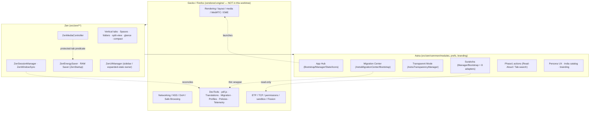

# Astra System Architecture Map (Phase 1)

> Source identity: `HUMAN_APPROVED_ASTRA_62_CATALOG_2026-07-19`
> Baseline branch: `architecture/astra-capability-rfcs`
> Baseline HEAD: `29d95dd9ee311331f328e4c57162bddc7a900d36`
>
> **Vendor-baseline caveat:** the vendored Firefox `engine/` tree is **not present** in this
> architecture worktree. Only the Astra/Zen overlay is present (`src/`, `prefs/`, `configs/`,
> `locales/`, `mods/`). The per-file upstream base revision therefore cannot be proven here and is
> recorded as **`UNVERIFIED — VENDOR BASELINE NOT PINNED`** in the patch inventory (the capability
> matrix documents the base engine as Firefox `149.0.2` at audit baseline `1d27263`, not
> re-verifiable in this worktree). See ASTRA-CONFLICT-031.

## Layered ownership

Ownership rule (upheld throughout): **Firefox is the canonical backend; Zen owns tab/sidebar/
Space; Astra adds experience + truthful presentation.** Astra/Zen must not duplicate native
storage, security, networking, profile, migration, PDF, translation, DevTools, policy, media, or
accessibility backends.

## Module boundary list (from walking the worktree tree)

| Layer | Location | Role | In this worktree? |
|---|---|---|---|
| Gecko/Firefox engine | `engine/**` | Vendored Firefox 149 backend (rendering, networking, platform) | **No** (absent; patched via `src/**/*.patch`) |
| Upstream overlay patches | `src/{browser,toolkit,dom,docshell,layout,modules,security,servo,widget,xpfe,devtools,build,testing,tools}/**/*.patch` | Astra/Zen modifications applied onto vendored Firefox | Yes (189 patches) |
| Zen + Astra chrome | `src/zen/**` | Vertical tabs, Spaces, media controller, session sync, App Hub, Suraksha, Transparent Mode, Migration, Welcome | Yes |
| Astra/Zen shared modules | `src/zen/common/modules/**` | App Hub, Suraksha (+8 adapters), Transparency, Migration, Phase1 actions, Energy Saver, Session store, UI manager, Updates | Yes |
| Declarative prefs | `prefs/{firefox,fastfox,privatefox,zen}/*.yaml` | Pref overrides compiled into `zen.js` | Yes |
| Config/distribution | `configs/**` | Build/config (no bundled `policies.json`/ADMX per audit) | Yes |
| Localization | `locales/**` | Fluent strings / langpacks | Yes |
| Mods | `mods/**` | Zen mods (off by default; deferred — ASTRA-EXCLUSION-010) | Yes |

`src/zen/` subsystems present: `@types, common, compact-mode, downloads, drag-and-drop, folders,
fonts, glance, images, kbs, live-folders, media, mods, new-tab, sessionstore, share, spaces,
split-view, tabs, tests, toolkit, urlbar, vendor, welcome`.

## Upstream patch inventory — totals

Full per-file inventory: **[`astra-upstream-patch-inventory.csv`](./astra-upstream-patch-inventory.csv)**
(columns: `path, upstream_owner, base_revision, change_type, first_astra_commit, latest_astra_commit, risk, notes`).

- **Total patches:** 189
- **By risk:** high **29** · medium **58** · low **102**
- **By upstream owner:** browser 108 · toolkit 36 · dom 6 · root 6 · external-patches 5 · tools 5 · widget 4 · build 3 · devtools 3 · servo 3 · testing 3 · modules 2 · docshell 1 · layout 1 · python 1 · security 1 · xpfe 1
- **base_revision:** `UNVERIFIED — VENDOR BASELINE NOT PINNED` for all rows (engine tree absent; see caveat above).

### Highest-risk files (risk = high, 29)

Session/tab/profile/update core — the reviewer-critical cluster:

- `src/browser/components/sessionstore/{SessionFile,SessionSaver,SessionStartup,SessionStore,TabGroupState,TabState,TabStateFlusher}-sys-mjs.patch` (session dual-store — ASTRA-CONFLICT-019)
- `src/browser/components/tabbrowser/{AsyncTabSwitcher,TabUnloader,TabsList}-sys-mjs.patch`, `content/{browser-ctrlTab,drag-and-drop,tab,tabbrowser,tabgroup,tabs}-js.patch` (tab model — ASTRA-CONFLICT-002; TabUnloader → ASTRA-CONFLICT-030)
- `src/browser/base/content/browser-profiles-js.patch`, `src/toolkit/profile/nsToolkitProfileService-cpp.patch` (profiles dual system — ASTRA-CONFLICT-003)
- `src/toolkit/modules/UpdateUtils-sys-mjs.patch`, `src/toolkit/mozapps/update/updater/updater-common-build.patch`, `src/toolkit/mozapps/extensions/internal/AddonUpdateChecker-sys-mjs.patch` (update integrity — ASTRA-CONFLICT-027)
- `src/docshell/base/nsAboutRedirector-cpp.patch`, `src/browser/themes/shared/tabbrowser/{content-area,ctrlTab,tabs}-css.patch`, `src/build/pgo/profileserver-py.patch`, `src/security/mac/hardenedruntime/production/firefox-browser-xml.patch`, `src/testing/profiles/{mochitest,profileserver}/user-js.patch`

## Notes

- Risk is a documented heuristic keyed on path tokens (session/tab/profile/update/security/
  policy/media/permissions => higher). It is intentionally conservative; refine per-file in the
  Phase 1 CSV as engine cross-checks become available.
- The Phase 1 CSV is the scaling artifact; this document carries only totals, the highest-risk
  set, and the link (per the PATCH INVENTORY SCALING RULE).
