# Astra Dependency / Wiring Graph (Phase 1)

> Source identity: `HUMAN_APPROVED_ASTRA_62_CATALOG_2026-07-19`
> Baseline branch: `architecture/astra-capability-rfcs`
> Baseline HEAD: `29d95dd9ee311331f328e4c57162bddc7a900d36`
>
> Per capability ID: exact upstream file(s) by source precedence, the existing Astra/Zen modules
> already touching related state, `state_refs`, and `conflict_refs`.
>
> **Precedence / worktree caveat:** upstream `engine/**` paths are cited from the capability matrix
> at audit baseline `1d27263` and are **not present** in this architecture worktree
> (ASTRA-CONFLICT-031); they are marked "(engine — not in worktree)". Astra/Zen paths under `src/`
> and `prefs/` were verified present in this worktree at HEAD.

## Group 1 — Student & Reading (ASTRA-CAP-001..010)

| Cap | Upstream implementation (engine — not in worktree) | Astra/Zen modules & prefs (verified in worktree) | state_refs | conflict_refs |
|---|---|---|---|---|
| 001 PDF viewing | `engine/toolkit/components/pdfjs/` | `prefs/firefox/pdf.yaml` | ASTRA-STATE-008 | — |
| 002 PDF annotations | `engine/toolkit/components/pdfjs/` | `prefs/firefox/pdf.yaml` (`pdfjs.enableHighlightEditor`) | ASTRA-STATE-008 | — |
| 003 PDF forms | `engine/toolkit/components/pdfjs/` (XFA) | `prefs/firefox/pdf.yaml` | ASTRA-STATE-008 | — |
| 004 PDF signatures | `engine/toolkit/components/pdfjs/` | `prefs/firefox/pdf.yaml` | ASTRA-STATE-008 | — |
| 005 Print / Save as PDF | `engine/` printing + pdf.js | `src/browser/.../zen-panels/print.css` | ASTRA-STATE-008 | — |
| 006 Reader Mode | `engine/toolkit/components/reader/` | `src/toolkit/themes/shared/aboutReader-css.patch` | ASTRA-STATE-006 | — |
| 007 Narrate / Read Aloud | `engine/toolkit/components/narrate/` | `src/zen/common/modules/AstraPhase1Actions.mjs` (`cmd_zenReadAloud`) | ASTRA-STATE-006 | ASTRA-CONFLICT-025 |
| 008 Translation | `engine/toolkit/components/translations/` | `prefs/firefox/multilingual.yaml`, `prefs/firefox/newtab.yaml` | ASTRA-STATE-007 | — |
| 009 Model download/offline | `engine/toolkit/components/translations/` + Remote Settings | `prefs/firefox/multilingual.yaml` (`intl.multilingual.downloadEnabled`) | ASTRA-STATE-007 | — |
| 010 Screenshots | `engine/browser/components/screenshots/` | `src/browser/components/screenshots/overlay/overlay-css.patch` | ASTRA-STATE-002 | — |

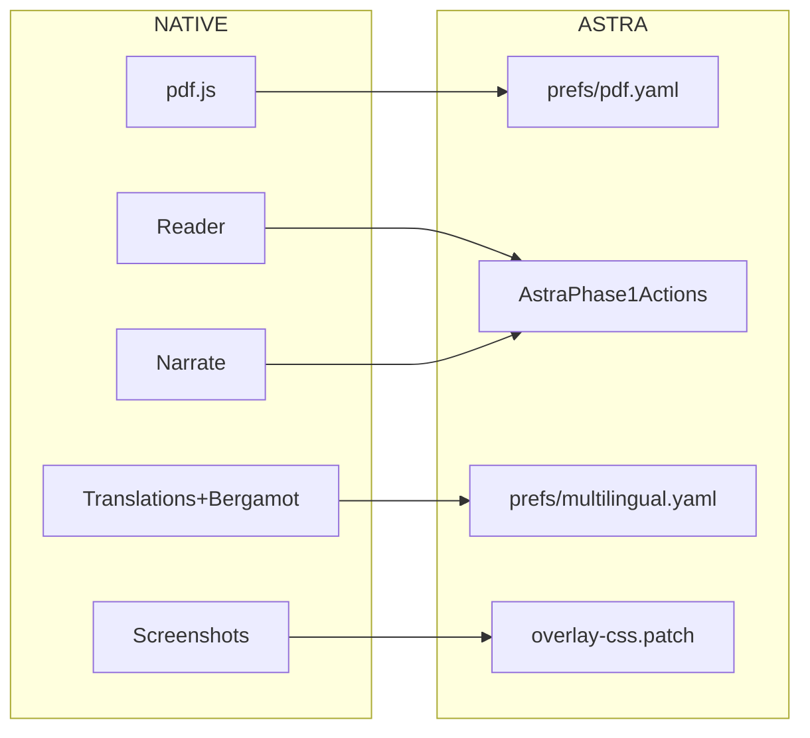

## Group 2 — Everyday Productivity (ASTRA-CAP-011..014)

| Cap | Upstream (engine — not in worktree) | Astra/Zen modules & prefs | state_refs | conflict_refs |
|---|---|---|---|---|
| 011 Downloads | `engine/browser/components/downloads/` | `src/zen/downloads/` (`ZenDownloadAnimation.mjs`, `ZenSmartGuard.mjs`), `prefs/zen/downloads.yaml` | ASTRA-STATE-002 | ASTRA-CONFLICT-014 |
| 012 Bookmarks/Places | `engine/browser/components/places/` | `src/zen/spaces/ZenSpaceBookmarksStorage.js`, `prefs/firefox/browser.yaml` (`sidebar.revamp`) | ASTRA-STATE-001, ASTRA-STATE-004 | — |
| 013 Open-tab search | `engine/browser/components/urlbar/` | `ZenUBGlobalActions.sys.mjs`, `AstraPhase1Actions.mjs`, `prefs/firefox/urlbar.yaml` | ASTRA-STATE-024 (rail) / in-memory tab index | ASTRA-CONFLICT-001, ASTRA-CONFLICT-025 |
| 014 Session restore | `engine/browser/components/sessionstore/` | `src/zen/sessionstore/` (`ZenSessionManager.sys.mjs`, `ZenWindowSync.sys.mjs`), `ZenSessionStore.mjs`, `prefs/zen/session-store.yaml` | ASTRA-STATE-003, ASTRA-STATE-004 | ASTRA-CONFLICT-002, ASTRA-CONFLICT-019, ASTRA-CONFLICT-021, ASTRA-CONFLICT-022 |

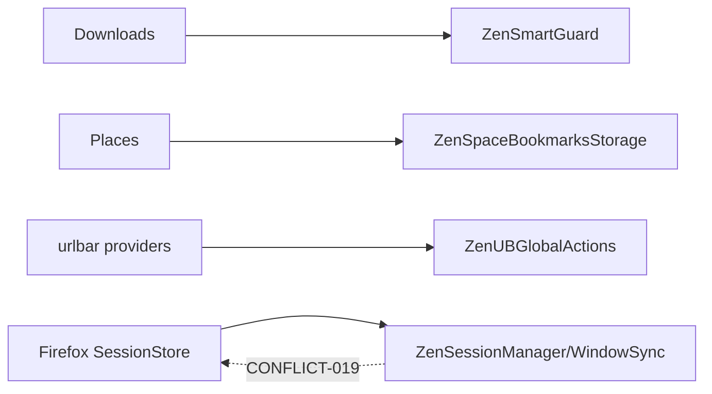

## Group 3 — Media & Classes (ASTRA-CAP-015..016)

| Cap | Upstream (engine — not in worktree) | Astra/Zen modules & prefs | state_refs | conflict_refs |
|---|---|---|---|---|
| 015 Picture-in-Picture | `engine/toolkit/components/pictureinpicture/` | `src/toolkit/.../pictureinpicture/player-css.patch`, `prefs/firefox/pip.yaml`, `prefs/zen/zen-urlbar.yaml` (`zen.urlbar.show-pip-button`) | ASTRA-STATE-016 | ASTRA-CONFLICT-011, ASTRA-CONFLICT-013, ASTRA-CONFLICT-030 |
| 016 Camera/mic/screen perms | `engine/dom/media/webrtc/`, `engine/browser/actors/WebRTCParent.sys.mjs` | Astra WebRTC patch → `gZenMediaController.updateMediaSharing`, `prefs/privatefox/privacy.yaml` (ICE) | ASTRA-STATE-009 | ASTRA-CONFLICT-012 |

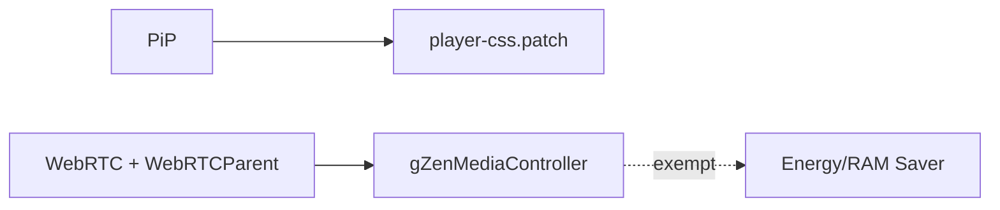

## Group 4 — Language & Access (ASTRA-CAP-017..018)

| Cap | Upstream (engine — not in worktree) | Astra/Zen modules & prefs | state_refs | conflict_refs |
|---|---|---|---|---|
| 017 Spellcheck/dictionaries | `engine/extensions/spellcheck/`, `locales/*/hunspell/` | `locales/**` (langpacks) | ASTRA-STATE-026 | — |
| 018 Zoom/contrast/reduced-motion/keyboard | `engine/accessible/`, `engine/layout/`, `engine/toolkit/themes/shared/design-system/` | design-system CSS; Astra/Zen custom controls (a11y audit) | ASTRA-STATE-005, ASTRA-STATE-027 | ASTRA-CONFLICT-017, ASTRA-CONFLICT-020, ASTRA-CONFLICT-026 |

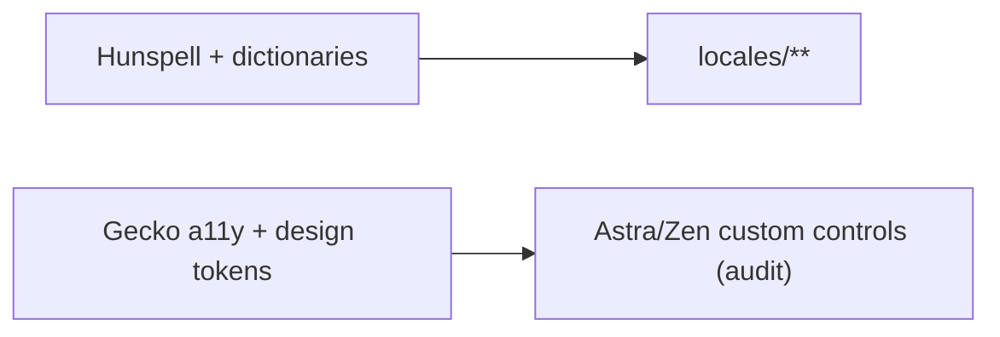

## Group 5 — Developer (ASTRA-CAP-019..032)

All 019–032 share `engine/devtools/{client,server,shared,startup}/` (and `engine/remote/` for
032); none are re-verifiable in this worktree. Astra layer = Developer Hub launcher + Zen KBS remap
(`src/zen/kbs/`). Backends must not be duplicated (ASTRA-EXCLUSION-002).

| Cap | Upstream (engine — not in worktree) | Astra/Zen | state_refs | conflict_refs |
|---|---|---|---|---|
| 019 Page Inspector | `engine/devtools/client/` | Zen KBS (Inspector C→L remap) | ASTRA-STATE-029 | ASTRA-CONFLICT-025, ASTRA-CONFLICT-029 |
| 020 Web Console | `engine/devtools/client/` | Zen KBS | ASTRA-STATE-029 | ASTRA-CONFLICT-025, ASTRA-CONFLICT-029 |
| 021 JS Debugger | `engine/devtools/client/` | Developer Hub | ASTRA-STATE-029 | ASTRA-CONFLICT-025, ASTRA-CONFLICT-029 |
| 022 Network Monitor | `engine/devtools/client/` | Developer Hub | ASTRA-STATE-029 | ASTRA-CONFLICT-025, ASTRA-CONFLICT-029 |
| 023 Storage Inspector | `engine/devtools/client/` | Developer Hub | ASTRA-STATE-029 | ASTRA-CONFLICT-025, ASTRA-CONFLICT-029 |
| 024 Responsive Design Mode | `engine/devtools/client/` | Developer Hub | ASTRA-STATE-029 | ASTRA-CONFLICT-025, ASTRA-CONFLICT-029 |
| 025 Accessibility Inspector | `engine/devtools/client/` | Developer Hub | ASTRA-STATE-029 | ASTRA-CONFLICT-025, ASTRA-CONFLICT-026 |
| 026 Performance Profiler | `engine/devtools/client/` | Developer Hub | ASTRA-STATE-029 | ASTRA-CONFLICT-025 |
| 027 Service Worker inspection | `engine/devtools/client/` | native | ASTRA-STATE-029 | ASTRA-CONFLICT-025 |
| 028 WebSocket inspection | `engine/devtools/client/` | native | ASTRA-STATE-029 | ASTRA-CONFLICT-025 |
| 029 Source maps / grid-flex | `engine/devtools/client/` | native | ASTRA-STATE-029 | ASTRA-CONFLICT-025 |
| 030 Browser Console | `engine/devtools/.../browser-toolbox/` | policy-gated | ASTRA-STATE-029 | ASTRA-CONFLICT-025, ASTRA-CONFLICT-029 |
| 031 Browser Toolbox | `engine/devtools/.../browser-toolbox/` | policy-gated | ASTRA-STATE-029 | ASTRA-CONFLICT-025, ASTRA-CONFLICT-029 |
| 032 Remote/add-on debugging | `engine/devtools/` + `engine/remote/` | `about:debugging`, testing-profile shortcut | ASTRA-STATE-029 | ASTRA-CONFLICT-004, ASTRA-CONFLICT-029 |

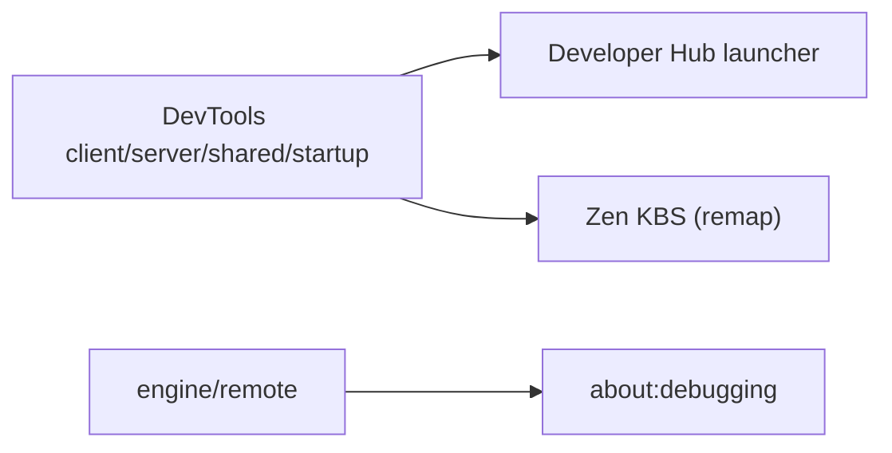

## Group 6 — Corporate (ASTRA-CAP-033..042)

| Cap | Upstream (engine — not in worktree) | Astra/Zen & prefs | state_refs | conflict_refs |
|---|---|---|---|---|
| 033 EnterprisePolicies | `engine/browser/components/enterprisepolicies/` (`Policies.sys.mjs`) | (no bundled `policies.json`) | ASTRA-STATE-017 | ASTRA-CONFLICT-024 |
| 034 GPO / ADMX | `WindowsGPOParser.sys.mjs` (templates absent) | ship Astra ADMX (Batch 4) | ASTRA-STATE-017 | ASTRA-CONFLICT-024 |
| 035 Managed bookmarks | policy engine + `engine/browser/components/places/` | ManagedBookmarks policy | ASTRA-STATE-001, ASTRA-STATE-017 | ASTRA-CONFLICT-024 |
| 036 Extension policies | policy engine + add-ons | ExtensionSettings policy; Suraksha uBlock adapter | ASTRA-STATE-020, ASTRA-STATE-017 | ASTRA-CONFLICT-009, ASTRA-CONFLICT-024 |
| 037 Proxy / DoH | `ProxyPolicies.sys.mjs`, `engine/netwerk/dns/` | `prefs/firefox/performance.yaml` (`network.trr.mode`) | ASTRA-STATE-014, ASTRA-STATE-017 | ASTRA-CONFLICT-024 |
| 038 Enterprise roots | `engine/security/manager/ssl/` | Certificates policy | ASTRA-STATE-017 | ASTRA-CONFLICT-024 |
| 039 Update policy | `engine/toolkit/mozapps/update/` | `src/build/moz-build.patch`, `prefs/zen/updates.yaml` | ASTRA-STATE-017, ASTRA-STATE-018 | ASTRA-CONFLICT-024, ASTRA-CONFLICT-027 |
| 040 Telemetry/crash policy | `engine/toolkit/components/telemetry/` (crashreporter absent) | `prefs/privatefox/privacy.yaml` | ASTRA-STATE-017, ASTRA-STATE-019 | ASTRA-CONFLICT-024 |
| 041 Managed status | `about:policies` | Astra managed-status panel (to build) | ASTRA-STATE-017 | ASTRA-CONFLICT-021, ASTRA-CONFLICT-022, ASTRA-CONFLICT-024, ASTRA-CONFLICT-026 |
| 042 Offline deployment | `src/browser/installer/windows/nsis/` + policy | distribution template (Batch 5) | ASTRA-STATE-017 | ASTRA-CONFLICT-024 |

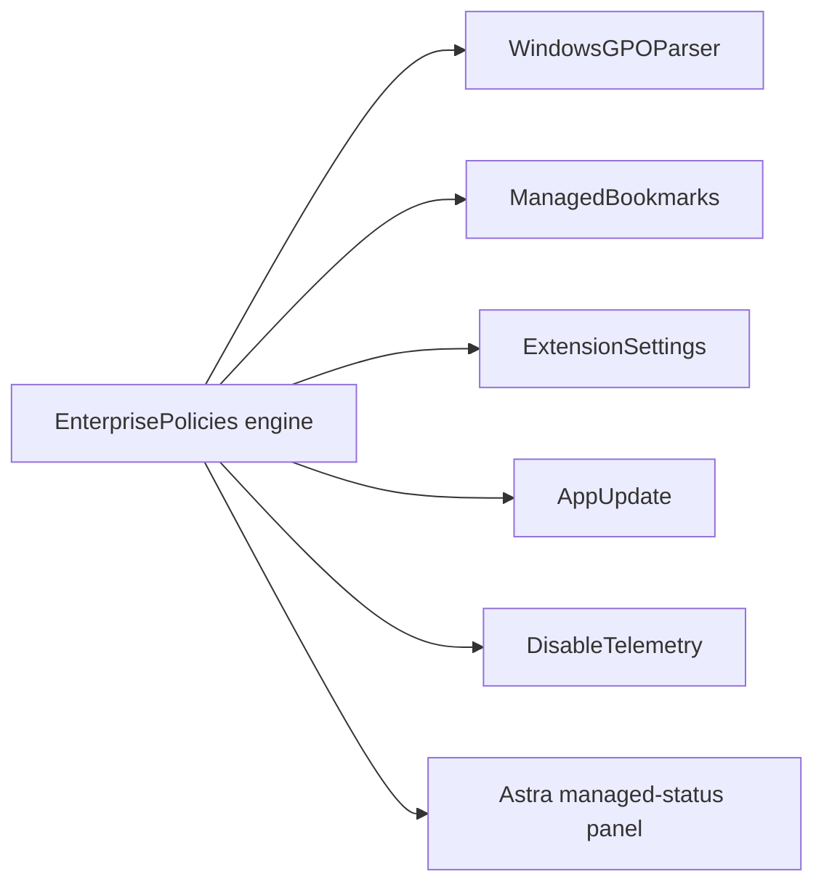

## Group 7 — Entertainment (ASTRA-CAP-043..049)

| Cap | Upstream (engine — not in worktree) | Astra/Zen & prefs | state_refs | conflict_refs |
|---|---|---|---|---|
| 043 Widevine/EME | `engine/dom/media/eme/`, `engine/dom/media/gmp/`, `GMPProvider.sys.mjs` | `prefs/zen/media.yaml` (`media.eme.enabled`) | ASTRA-STATE-015 | ASTRA-CONFLICT-010, ASTRA-CONFLICT-011, ASTRA-CONFLICT-030 |
| 044 OpenH264 / decode | `engine/dom/media/platforms/` | `prefs/firefox/performance.yaml` | ASTRA-STATE-015 | ASTRA-CONFLICT-011, ASTRA-CONFLICT-030 |
| 045 HW accel status | `engine/dom/media/platforms/` | `prefs/firefox/performance.yaml` (`media.hardware-video-decoding.enabled`) | (in-memory) | ASTRA-CONFLICT-015, ASTRA-CONFLICT-030 |
| 046 Media Session / controls | `engine/dom/media/mediacontrol/` | `src/zen/media/ZenMediaController.mjs`, `prefs/zen/zen.yaml` (`zen.mediacontrols.enabled`) | ASTRA-STATE-016 | ASTRA-CONFLICT-011, ASTRA-CONFLICT-013, ASTRA-CONFLICT-030 |
| 047 Autoplay | `engine/dom/media/` (`AutoplayPolicy.cpp`) | `prefs/firefox/browser.yaml` (`media.autoplay.default`) | ASTRA-STATE-009 | ASTRA-CONFLICT-030 |
| 048 Fullscreen/captions | `engine/dom/` + WebVTT | `prefs/firefox/fullscreen.yaml` | — | — |
| 049 Audio indicator/mute | `engine/dom/media/` + tab UI | Firefox/Zen tab UI | ASTRA-STATE-016 | ASTRA-CONFLICT-013, ASTRA-CONFLICT-030 |

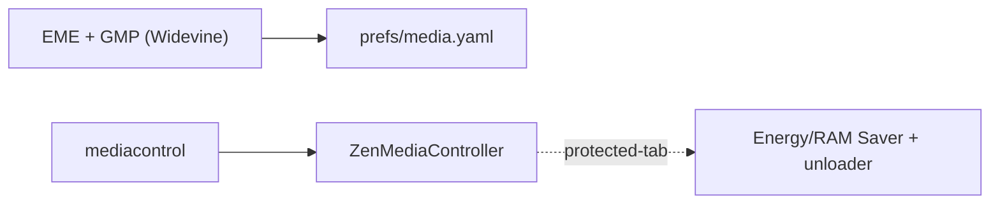

## Group 8 — Identity & Separation (ASTRA-CAP-050..054)

| Cap | Upstream (engine — not in worktree) | Astra/Zen & prefs | state_refs | conflict_refs |
|---|---|---|---|---|
| 050 Containers | `engine/toolkit/components/contextualidentity/` | `prefs/privatefox/privacy.yaml` (`privacy.userContext.enabled`) | ASTRA-STATE-010 | ASTRA-CONFLICT-003 |
| 051 Local profiles | `engine/toolkit/profile/` | `src/toolkit/profile/nsToolkitProfileService-cpp.patch`, `src/browser/base/content/browser-profiles-js.patch`, `prefs/firefox/browser.yaml` | ASTRA-STATE-011 | ASTRA-CONFLICT-003, ASTRA-CONFLICT-004, ASTRA-CONFLICT-005 |
| 052 Migration wizard | `engine/` MigrationWizard/MigrationUtils | `src/zen/common/modules/AstraMigrationCenter.mjs`, `AstraMigrationBootstrap.mjs` | ASTRA-STATE-001 | ASTRA-CONFLICT-005, ASTRA-CONFLICT-006 |
| 053 Import resources | `engine/` MigrationUtils | Migration Center entrypoints | ASTRA-STATE-001, ASTRA-STATE-011 | ASTRA-CONFLICT-005, ASTRA-CONFLICT-006 |
| 054 FxA / Sync | `engine/services/sync/`, `engine/services/fxaccounts/` | `prefs/zen/workspaces.yaml` (`services.sync.engine.workspaces`) | ASTRA-STATE-012 | ASTRA-CONFLICT-006, ASTRA-CONFLICT-028 |

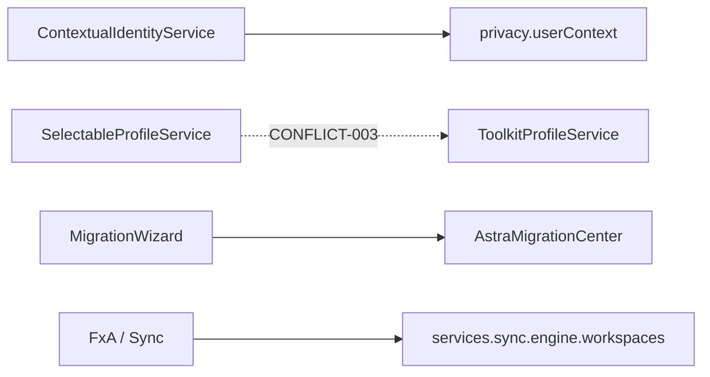

## Group 9 — Privacy & Security (ASTRA-CAP-055..059)

| Cap | Upstream (engine — not in worktree) | Astra/Zen & prefs | state_refs | conflict_refs |
|---|---|---|---|---|
| 055 ETP | `engine/toolkit/components/antitracking/` | `prefs/firefox/browser.yaml`; `AstraSurakshaProtection.mjs` | ASTRA-STATE-013 | ASTRA-CONFLICT-008, ASTRA-CONFLICT-009, ASTRA-CONFLICT-010 |
| 056 Total Cookie Protection | `engine/netwerk/` (cookieBehavior) | `prefs/privatefox/privacy.yaml` | ASTRA-STATE-013 | ASTRA-CONFLICT-010 |
| 057 Safe Browsing | `engine/` safebrowsing + Zen SMART Guard | `AstraSurakshaSafeBrowsing.mjs`, `src/zen/downloads/ZenSmartGuard.mjs` | ASTRA-STATE-002, ASTRA-STATE-013 | ASTRA-CONFLICT-010 |
| 058 Site permissions / clear-data | `engine/` permissions + sanitize | `AstraSurakshaPermissions.mjs`, `AstraSurakshaSiteData.mjs` | ASTRA-STATE-009 | ASTRA-CONFLICT-010, ASTRA-CONFLICT-023 |
| 059 HTTPS / DNS | `engine/netwerk/` | `prefs/privatefox/privacy.yaml` (`dom.security.https_only_mode`) | ASTRA-STATE-014 | ASTRA-CONFLICT-024 |

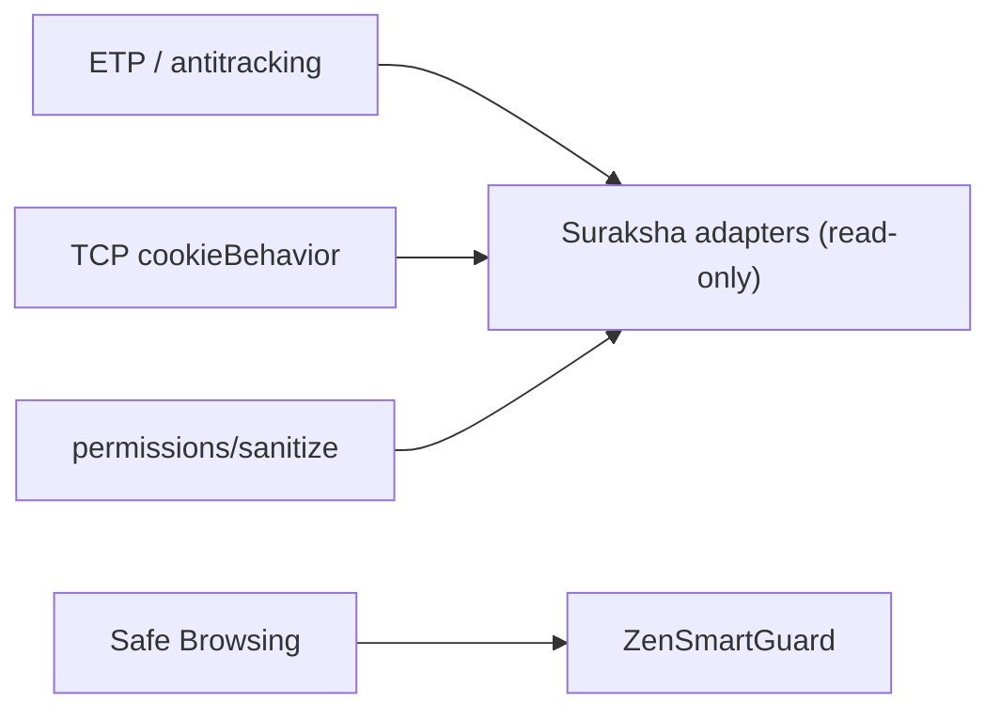

## Group 10 — Reliability (ASTRA-CAP-060)

| Cap | Upstream (engine — not in worktree) | Astra/Zen & prefs | state_refs | conflict_refs |
|---|---|---|---|---|
| 060 Updater/troubleshooting/recovery | `engine/toolkit/mozapps/update/` | `src/toolkit/modules/UpdateUtils-sys-mjs.patch`, `ZenUpdates.mjs`, `prefs/zen/updates.yaml` | ASTRA-STATE-018, ASTRA-STATE-003 | ASTRA-CONFLICT-019, ASTRA-CONFLICT-027 |

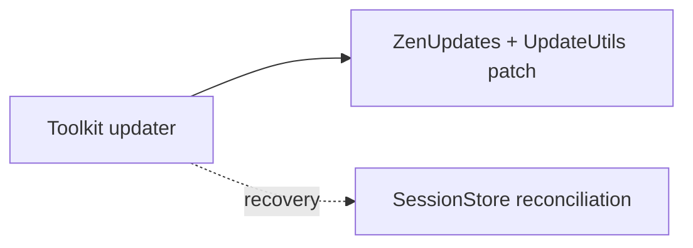

## Group 11 — Extensions (ASTRA-CAP-061)

| Cap | Upstream (engine — not in worktree) | Astra/Zen & prefs | state_refs | conflict_refs |
|---|---|---|---|---|
| 061 Add-ons + extension debugging | `engine/toolkit/mozapps/extensions/` | `prefs/firefox/extensions.yaml` (`xpinstall.signatures.required`), `AstraSurakshaUBlock.mjs` | ASTRA-STATE-020 | ASTRA-CONFLICT-009 |

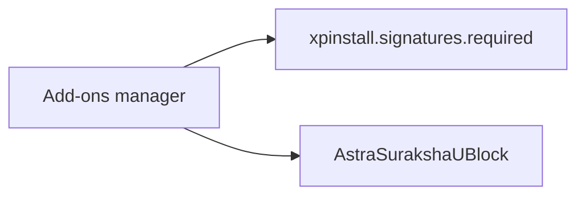

## Group 12 — India & Language (ASTRA-CAP-062)

| Cap | Upstream (engine — not in worktree) | Astra/Zen & prefs | state_refs | conflict_refs |
|---|---|---|---|---|
| 062 India / Indian-language | `engine/toolkit/components/translations/`, `engine/extensions/spellcheck/`, `locales/**` | `prefs/firefox/india.yaml` (`intl.accept_languages`, `browser.search.region`), App Hub India catalog | ASTRA-STATE-028, ASTRA-STATE-007, ASTRA-STATE-026 | ASTRA-CONFLICT-020 |

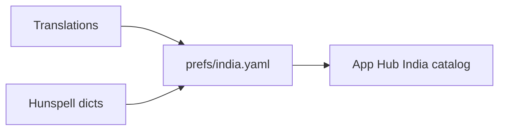

## Notes

- Every `state_refs`/`conflict_refs` above matches the corresponding registry record and resolves
  to a row in `astra-state-ownership.md` / `astra-conflict-resolution.md` (validator-enforced).
- Engine paths are documentary (matrix baseline `1d27263`); Phase 2+ raises evidence only when the
  pinned engine checkout is cross-checked at build time.
